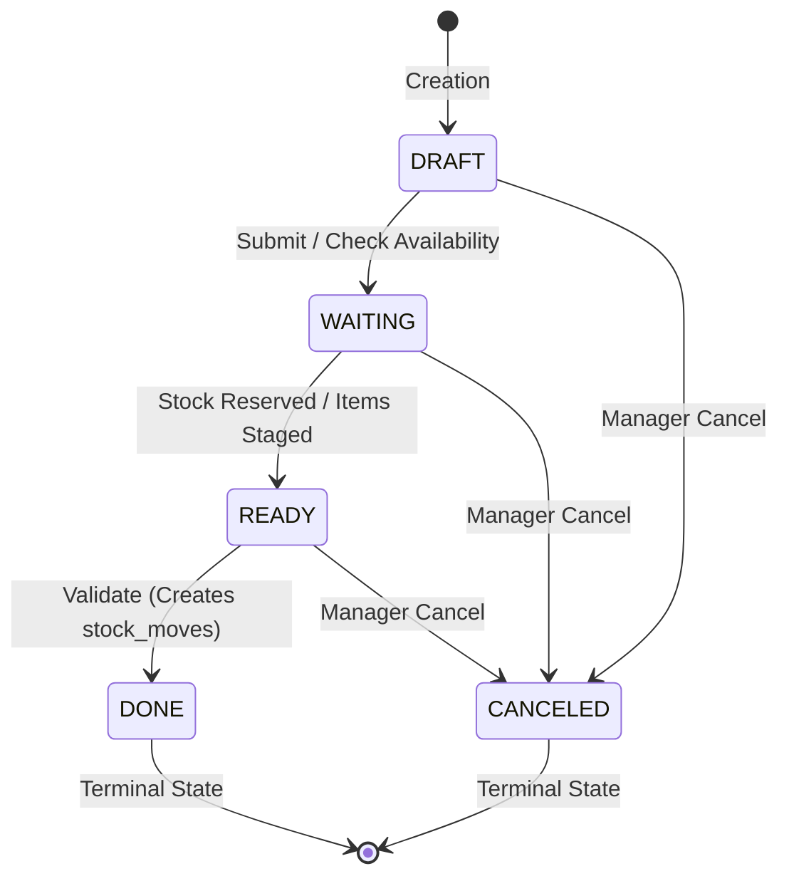

# StockSense Pro — Product & Architectural Specification

**Version:** 1.0.0  
**Status:** Approved / Baseline Architecture  
**Target Event:** Odoo Hackathon  
**Problem Statement:** Replace error-prone Excel spreadsheets and manual paper-based stock registers with a high-performance, real-time, modular Inventory Management System (IMS).

---

## 1. Executive Summary & Vision

StockSense Pro modernizes warehouse operations by bringing double-entry inventory mechanics (inspired by Odoo's core paradigm) into a sleek, real-time web application. 

Manual registers and spreadsheet workarounds suffer from:
- Desynchronized counts and phantom inventory
- Lack of auditability and missing attribution on who moved what, when, and why
- Bottlenecks during physical counts, picking, and receiving
- Zero real-time visibility across warehouse locations

**StockSense Pro** solves these fundamental issues with:
1. An immutable **double-entry ledger** (`stock_moves`) acting as the single source of truth.
2. A strict **document state machine** (DRAFT → WAITING → READY → DONE).
3. **Role-Based Access Control (RBAC)** clearly separating operational execution (`STAFF`) from administrative oversight (`MANAGER`).
4. **Real-time multi-warehouse synchronization** via Socket.io.
5. **Mobile-friendly camera QR/Barcode scanning** using `html5-qrcode`.

---

## 2. Technology Stack

### 2.1 Client Application (`/client`)
- **Core Framework:** React 18 with Vite (TypeScript)
- **Styling & Design System:** Tailwind CSS with `shadcn/ui` (accessible Radix UI primitives)
- **State Management:** Zustand (lightweight, predictable global state + optimistic store updates)
- **Real-Time Transport:** Socket.io Client
- **Barcode / QR Scanning:** `html5-qrcode` (hardware & mobile camera barcode reading)
- **Data Fetching & Validation:** Axios / Fetch with Zod schema parsing
- **Icons & Visuals:** Lucide React

### 2.2 Server Application (`/server`)
- **Runtime & Framework:** Node.js (v20+) with Express (TypeScript)
- **Database & ORM:** PostgreSQL with Prisma ORM
- **Real-Time Engine:** Socket.io (rooms segmented per warehouse: `warehouse:<warehouse_id>`)
- **Schema Validation:** Zod on **every** route (request body, params, query)
- **Authentication & Security:** 
  - JWT in `httpOnly`, `SameSite=Lax`, `Secure` cookies
  - Argon2/Bcrypt password hashing
  - SHA-256 hashed 6-digit OTPs for password resets
- **API Versioning:** All endpoints prefixed with `/api/v1`

---

## 3. Core Architectural Paradigm: The Double-Entry Stock Ledger

### 3.1 Single Source of Truth (`stock_moves`)
Inventory is **never** mutated via arbitrary `UPDATE products SET stock = stock + X`. Instead, every movement of goods in the real world is recorded as an immutable move record between a source location (`from_location_id`) and a destination location (`to_location_id`).

```
+-----------------------------------------------------------------------------------+
|                                  stock_moves                                      |
+----+------------+------------------+----------------+-----+----------+-------------+
| id | product_id | from_location_id | to_location_id | qty | ref_type | document_id |
+----+------------+------------------+----------------+-----+----------+-------------+
```

### 3.2 Location Types
Locations represent physical or virtual places:
1. **Internal Locations (`INTERNAL`):** Physical shelves, bays, racks, zones, or staging areas inside a warehouse owned by the company (e.g., `WH/Stock`, `WH/Input`, `WH/Packing`).
2. **Vendor Locations (`VENDOR`):** Virtual counterpart location representing supplier origins.
3. **Customer Locations (`CUSTOMER`):** Virtual counterpart location representing delivery destinations.
4. **Inventory Loss / Scrap Locations (`LOSS` / `INVENTORY_LOSS`):** Virtual locations used for counter-balancing adjustments, shrinkages, spoilage, or found stock.

### 3.3 Derived Stock Quantities & Reporting
- Current on-hand quantity for any `(product, internal_location)` is deterministically derived from:
  $$\text{Stock}_{\text{loc}} = \sum (\text{moves IN to loc}) - \sum (\text{moves OUT from loc})$$
- A materialized cache / `stock_quants` table is maintained inside database transactions for $O(1)$ fast lookups, but `stock_moves` remains the indisputable audit trail.

---

## 4. User Personas & Role-Based Access Control (RBAC)

| Feature / Operation | `STAFF` | `MANAGER` | Notes |
| :--- | :---: | :---: | :--- |
| **Authenticate / Password Reset** | ✅ | ✅ | OTP verification required for password reset |
| **View Inventory & Real-Time Moves** | ✅ | ✅ | Filterable by assigned warehouse |
| **Scan QR/Barcodes** | ✅ | ✅ | Fast lookup of products and bins |
| **Create Documents (Drafts)** | ✅ | ✅ | Receipts, Deliveries, Transfers, Adjustments |
| **Update Document Items (Draft/Waiting)** | ✅ | ✅ | Modify quantities, lines before validation |
| **Progress Document to READY** | ✅ | ✅ | When picking/packing/counting is complete |
| **Validate Operations (READY → DONE)** | ✅ | ✅ | Writes final records to `stock_moves` |
| **Cancel Documents (DRAFT/WAITING/READY)** | ❌ | ✅ | **Managers only** can cancel open operations |
| **Cancel / Revert DONE Documents** | ❌ | ❌ | **Strictly forbidden**; requires counter-adjustment |
| **Master Data CRUD** | ❌ | ✅ | Products, Categories, Locations, Warehouses |
| **User & Staff Management** | ❌ | ✅ | Assign roles, warehouses, active status |

---

## 5. Document Status Lifecycle Machine

All operational documents (**Receipts**, **Delivery Orders**, **Internal Transfers**, **Stock Adjustments**) follow a strict finite state machine:



### State Definitions & Rules
1. **`DRAFT`**: Document created, editable. No reservation of stock.
2. **`WAITING`**: Document submitted. In delivery orders, waiting for available items; in receipts, waiting for arrival.
3. **`READY`**: Items physically present, picked/packed, or verified. Ready for formal validation.
4. **`DONE`**: **Terminal State.** 
   - **Validation is ONLY permitted when status is `READY`**.
   - Upon moving to `DONE`, atomic database transaction commits moves to `stock_moves`.
   - Cannot be modified or canceled once `DONE`.
5. **`CANCELED`**: **Terminal State.**
   - Allowed only prior to `DONE` (`DRAFT`, `WAITING`, or `READY`).
   - Only executable by users with `MANAGER` role.
   - Any reservations are freed immediately.

---

## 6. Core Inventory Workflows

### 6.1 Receipts (Incoming Shipments, Stock +)
- **Business Event:** Goods arrive from an external vendor.
- **Move Direction:** Virtual Vendor Location (`VENDOR`) $\rightarrow$ Internal Warehouse Location (`WH/Input` or `WH/Stock`).
- **Effect on Stock:** Increases company inventory.
- **Lifecycle:**
  1. Create Receipt in `DRAFT` with vendor name, target warehouse, and line items.
  2. Mark `WAITING` when PO is dispatched.
  3. Goods dock at bay $\rightarrow$ Staff counts/scans barcodes $\rightarrow$ Move to `READY`.
  4. Validation creates `stock_moves` ($+\text{qty}$ in warehouse). Status becomes `DONE`.

### 6.2 Delivery Orders (Outgoing Orders, Stock −)
- **Business Event:** Customer fulfillment or shipment dispatch.
- **Move Direction:** Internal Warehouse Location (`WH/Stock`) $\rightarrow$ Virtual Customer Location (`CUSTOMER`).
- **Effect on Stock:** Decreases company inventory.
- **Fulfillment Sub-steps:**
  1. `DRAFT`: Order received from customer.
  2. `WAITING`: System checks on-hand quantity. If available, stock is reserved.
  3. **Pick & Pack:** Warehouse staff uses QR scanner to pick items from shelves and pack into boxes.
  4. Move to `READY` once picking and packing matches order lines.
  5. Validate (`READY` $\rightarrow$ `DONE`): Finalizes `stock_moves` ($-\text{qty}$ out of warehouse).

### 6.3 Internal Transfers (Rebalancing / Inter-Bin Transfers)
- **Business Event:** Moving goods between aisles, shelves, or across warehouses.
- **Move Direction:** Internal Location A $\rightarrow$ Internal Location B (e.g., `WH/Stock/A-01` $\rightarrow$ `WH/Stock/B-03`).
- **Effect on Stock:** **Net total inventory across enterprise remains unchanged**; individual location balances update.
- **Lifecycle:**
  1. Create Transfer in `DRAFT`.
  2. Move to `READY` when physical relocation begins.
  3. Staff confirms destination scan $\rightarrow$ Validate to `DONE`.

### 6.4 Stock Adjustments (Cycle Counting & Reconciliations)
- **Business Event:** Physical periodic inventory count discovers discrepancies (theft, damage, data entry mistake, found goods).
- **Move Direction:**
  - If Theoretical count (10) > Physical count (8): Internal Location $\rightarrow$ Virtual Inventory Loss (`LOSS`) for 2 units.
  - If Theoretical count (10) < Physical count (13): Virtual Inventory Loss (`LOSS`) $\rightarrow$ Internal Location for 3 units.
- **Mandatory Requirements:**
  - Every adjustment **MUST** include a mandatory **Reason Code** (`DAMAGED`, `EXPIRED`, `LOST_THEFT`, `INVENTORY_COUNT_CORRECTION`, `FOUND_STOCK`) and an explanatory note.
  - Managers can review discrepancy deltas before validation.

---

## 7. Authentication & Security Architecture

### 7.1 JWT & Session Handling
- **Storage:** Secure `httpOnly`, `SameSite=Lax`, `Secure` (in production) cookies named `stocksense_token`.
- **Payload:** `{ userId: string, email: string, role: "MANAGER" | "STAFF", warehouseId?: string }`.
- **Expiry:** Short-lived access token (e.g., 24 hours), refreshable.

### 7.2 OTP-Based Password Reset Flow
1. **Request:** User submits email via `/api/v1/auth/forgot-password`.
2. **Generation:** Server generates a cryptographically random **6-digit numerical code**.
3. **Hashing:** The OTP is hashed using SHA-256 before storage in the database table `password_resets`. Plaintext OTP is sent via email/notification log.
4. **Constraints:**
   - **TTL:** Exactly 10 minutes expiry timestamp.
   - **Single-use:** Once verified or used, the record is immediately invalidated/marked `used_at = NOW()`.
   - **Rate Limiting:** Max 3 OTP requests per hour per email address to mitigate abuse.
5. **Execution:** User submits `{ email, otp, newPassword }` to `/api/v1/auth/reset-password`.

---

## 8. Real-Time Engine (Socket.io)

To give warehouse managers and floor staff live awareness without manual page refreshing:
- **Room Segmentation:** `socket.join("warehouse:" + warehouseId)`.
- **Events Emitted:**
  - `stock:move_created`: Broadcast whenever a document reaches `DONE`.
  - `document:status_changed`: Broadcast document lifecycle transitions (`WAITING`, `READY`, `DONE`, `CANCELED`).
  - `alert:low_stock`: Triggered when available stock falls below defined safety reorder thresholds.
- **Optimistic Zustand Updates:** The frontend Zustand store receives socket events and updates inventory counts and tables in real time.

---

## 9. Barcode & QR Code Scanning Architecture

- Powered by `html5-qrcode` in the web browser.
- Uses mobile device camera or USB handheld wedge scanner.
- **Workflow:**
  - Scan product barcode $\rightarrow$ auto-focus product in line item.
  - Scan shelf location barcode (e.g., `LOC-WH1-A12`) $\rightarrow$ auto-select source/destination location.
  - Beep/haptic feedback on successful scan match.

---

## 10. Data Model (Prisma Schema Outline)

```prisma
enum Role {
  MANAGER
  STAFF
}

enum DocStatus {
  DRAFT
  WAITING
  READY
  DONE
  CANCELED
}

enum DocType {
  RECEIPT
  DELIVERY
  INTERNAL_TRANSFER
  ADJUSTMENT
}

enum LocationType {
  INTERNAL
  VENDOR
  CUSTOMER
  LOSS
}

enum AdjustmentReason {
  DAMAGED
  EXPIRED
  LOST_THEFT
  INVENTORY_COUNT_CORRECTION
  FOUND_STOCK
}

model User {
  id           String        @id @default(uuid())
  email        String        @unique
  passwordHash String
  name         String
  role         Role          @default(STAFF)
  warehouseId  String?
  warehouse    Warehouse?    @relation(fields: [warehouseId], references: [id])
  stockMoves   StockMove[]
  documents    Document[]
  createdAt    DateTime      @default(now())
  updatedAt    DateTime      @updatedAt
}

model PasswordReset {
  id        String    @id @default(uuid())
  email     String
  otpHash   String
  expiresAt DateTime
  usedAt    DateTime?
  createdAt DateTime  @default(now())
}

model Warehouse {
  id        String     @id @default(uuid())
  code      String     @unique // e.g. "WH1"
  name      String
  address   String?
  locations Location[]
  users     User[]
  documents Document[]
  createdAt DateTime   @default(now())
}

model Location {
  id          String       @id @default(uuid())
  name        String       // e.g. "Stock Shelf A-1"
  barcode     String?      @unique
  type        LocationType @default(INTERNAL)
  warehouseId String?
  warehouse   Warehouse?   @relation(fields: [warehouseId], references: [id])
  movesFrom   StockMove[]  @relation("MovesFrom")
  movesTo     StockMove[]  @relation("MovesTo")
}

model Product {
  id          String        @id @default(uuid())
  sku         String        @unique
  barcode     String?       @unique
  name        String
  description String?
  category    String
  unit        String        @default("Units") // "Units", "kg", "liters", etc.
  minStock    Int           @default(10)
  moves       StockMove[]
  docItems    DocItem[]
  createdAt   DateTime      @default(now())
}

model Document {
  id             String            @id @default(uuid())
  docNumber      String            @unique // e.g. "REC-2026-0001", "DEL-2026-0042"
  type           DocType
  status         DocStatus         @default(DRAFT)
  warehouseId    String
  warehouse      Warehouse         @relation(fields: [warehouseId], references: [id])
  userId         String
  user           User              @relation(fields: [userId], references: [id])
  partnerName    String?           // Vendor or Customer name
  reasonCode     AdjustmentReason? // Mandatory for type == ADJUSTMENT
  reasonNote     String?
  items          DocItem[]
  stockMoves     StockMove[]
  createdAt      DateTime          @default(now())
  validatedAt    DateTime?
  canceledAt     DateTime?
}

model DocItem {
  id         String   @id @default(uuid())
  documentId String
  document   Document @relation(fields: [documentId], references: [id], onDelete: Cascade)
  productId  String
  product    Product  @relation(fields: [productId], references: [id])
  expectedQty Float
  doneQty    Float    @default(0)
}

model StockMove {
  id             String       @id @default(uuid())
  productId      String
  product        Product      @relation(fields: [productId], references: [id])
  fromLocationId String
  fromLocation   Location     @relation("MovesFrom", fields: [fromLocationId], references: [id])
  toLocationId   String
  toLocation     Location     @relation("MovesTo", fields: [toLocationId], references: [id])
  qty            Float
  refType        DocType
  documentId     String
  document       Document     @relation(fields: [documentId], references: [id])
  userId         String
  user           User         @relation(fields: [userId], references: [id])
  createdAt      DateTime     @default(now())
}
```

---

## 11. REST API Specification (`/api/v1`)

All endpoints parse and enforce **Zod** schema validations on requests.

### 11.1 Authentication & Profile
- `POST /api/v1/auth/register` — Register initial user (Manager bootstrap)
- `POST /api/v1/auth/login` — Login, sets `stocksense_token` httpOnly cookie
- `POST /api/v1/auth/logout` — Clears authentication cookie
- `GET /api/v1/auth/me` — Returns current authenticated user and role
- `POST /api/v1/auth/forgot-password` — Generates 6-digit OTP (10 min TTL)
- `POST /api/v1/auth/reset-password` — Verifies OTP hash and updates password

### 11.2 Master Data (Manager only for mutations)
- `GET /api/v1/warehouses`, `POST /api/v1/warehouses`
- `GET /api/v1/locations`, `POST /api/v1/locations`
- `GET /api/v1/products`, `POST /api/v1/products`, `PUT /api/v1/products/:id`

### 11.3 Documents & Operations (Receipts, Deliveries, Transfers, Adjustments)
- `GET /api/v1/documents?type=...&status=...` — Filterable list of operational documents
- `POST /api/v1/documents` — Create document in `DRAFT` state
- `GET /api/v1/documents/:id` — Detail view with lines and move status
- `PATCH /api/v1/documents/:id/status` — State machine transition (`WAITING`, `READY`)
- `POST /api/v1/documents/:id/validate` — **Execute validation from `READY` to `DONE`**
- `POST /api/v1/documents/:id/cancel` — **Manager-only cancellation**

### 11.4 Inventory Ledger & Analytics
- `GET /api/v1/stock/moves` — Complete immutable audit log of `stock_moves`
- `GET /api/v1/stock/levels?warehouseId=...` — Computed on-hand balances per product/location
- `GET /api/v1/stock/kpis` — Total items, low stock alerts, pending deliveries/receipts
